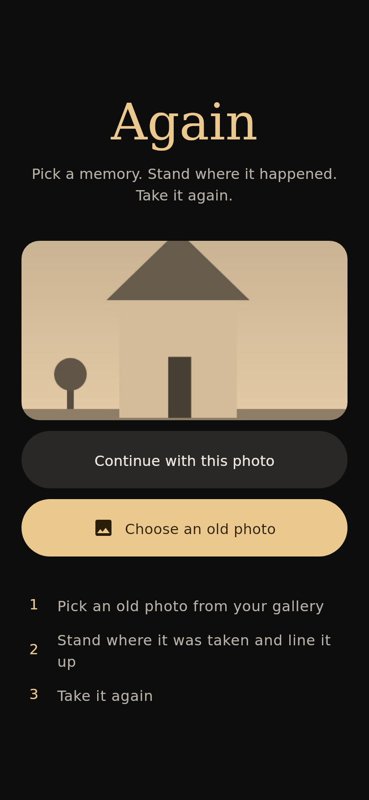
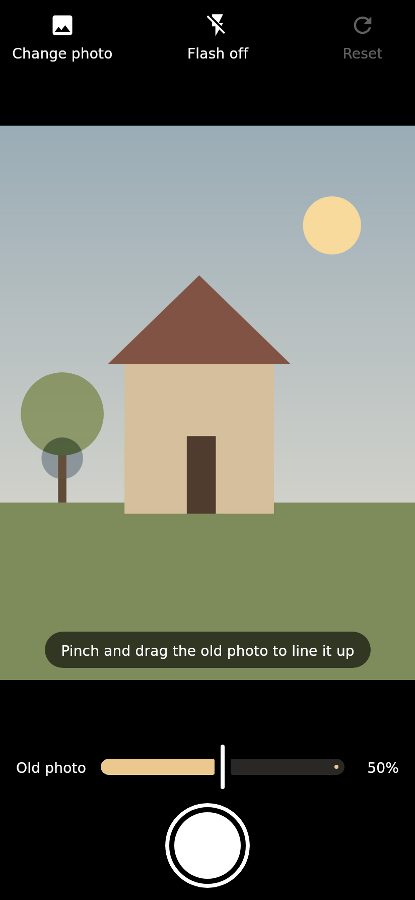
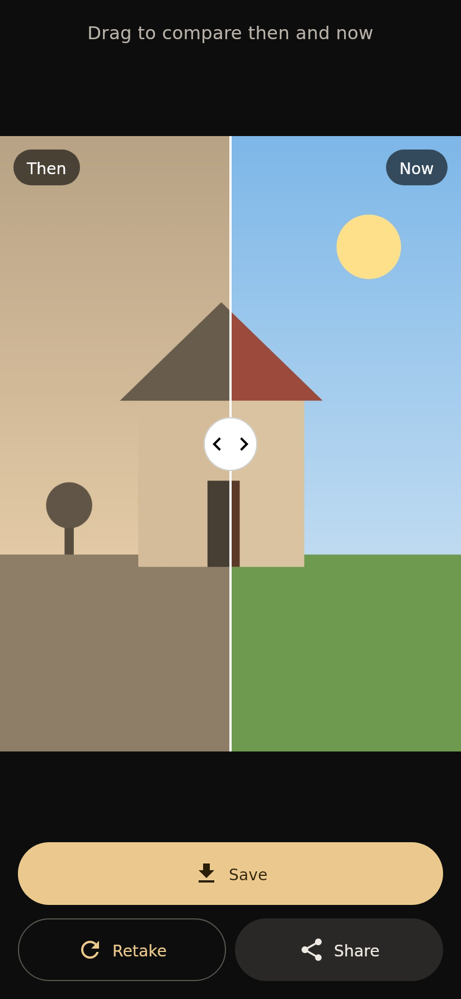
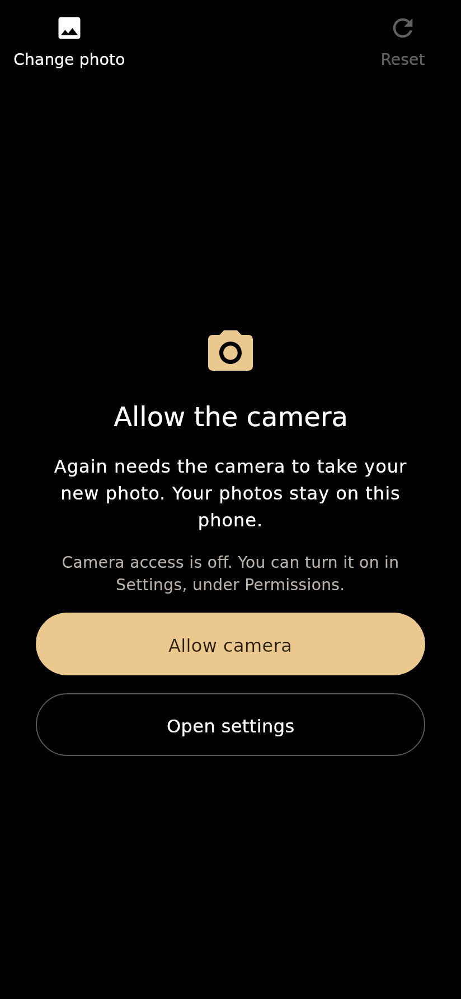

<h1 align="center">Again</h1>

<p align="center"><strong>Pick a memory. Stand where it happened. Take it again.</strong></p>

<p align="center">
  A simple camera for recreating an old photograph from the exact same spot: the old photo floats<br>
  over the live camera, you line the two up, and take the new one.
</p>

<p align="center">
  
  
</p>

On the stores as **Again Camera: Then & Now**.

<p align="center">
  
  
  
  
</p>

<p align="center"><sub>From the desktop harness, where a drawn scene stands in for the camera and a sepia copy of it for the old photo.
All of them: <a href="docs/screenshots">docs/screenshots</a>.</sub></p>

## Features

- **Choose an old photo** from the gallery with the system photo picker. The last one stays on the
  home screen, one tap from the camera.
- **The old photo over the live camera**, half see-through, in a frame shaped like it. Pinch, drag and
  twist it into line; a slider sets how strongly it shows; Reset puts it back.
- **A clean photograph.** The shutter takes the camera's own picture. The old photo over the viewfinder
  is a guide on screen and never ends up in the new photo.
- **Then and now** in one frame, split by a divider to drag across.
- **Save** to the gallery (Pictures › Again), **Share**, or **Retake** with the old photo still lined up.
- **English and Russian.** Large controls, words next to every icon, screen-reader labels throughout.

No account, no server, no analytics, no ads.

## How it works

The camera screen's frame has the old photo's proportions, and the new photograph is cropped to
exactly what that frame shows: by CameraX on Android (a `ViewPort` shared by `Preview` and
`ImageCapture`), and on iOS by cutting AVFoundation's photo down to what its preview layer shows. So the new photo
has the old one's shape, and the comparison can draw both in one frame: the new photo filling it, the
old one placed by the same pinch, drag and twist that lined it up in the viewfinder.

The guide's position is an `OverlayTransform` in fractions of the frame, not pixels, so the same
alignment holds in the viewfinder, with the phone turned, and in the comparison.

## Architecture

The shape of [Gains](https://github.com/gerra/gains), much smaller.

```
shared/        Pure Kotlin: what a recreation is, no camera, image or UI types.
  domain/        OverlayTransform (scale, offset, turn, and their bounds), Guide (the old photo,
                 its opacity and transform), ReferencePhoto, CapturedPhoto
  comparison/    ComparisonState (the divider)
composeApp/    Compose Multiplatform UI and the platform boundary.
  commonMain/    App, ui/ (a small ScreenModel, a three-screen Navigator, Home/Camera/Compare,
                 AgainTheme), platform/ (the Camera and Photos interfaces), composeResources/
  androidMain/   MainActivity, AndroidCamera (CameraX), AndroidPhotos (photo picker, MediaStore,
                 share sheet)
  iosMain/       MainViewController, IosPhotos (PHPicker, PhotoKit, share sheet), IosCamera and
                 IosCameraSession (AVFoundation)
  skikoMain/     Photo decoding with EXIF orientation, shared by the desktop and iOS
  desktopMain/   Development harness: the whole app with a drawn scene for a camera
iosApp/        The SwiftUI wrapper and Xcode project.
```

The shared UI knows the camera only through two small interfaces in `composeApp/.../platform`:
`Camera` (the permission and a composable `Preview` that opens the camera while it is on screen)
and `CameraController` (`capture()` and the flash). Android owns the CameraX lifecycle behind them,
and iOS an `AVCaptureSession` behind the same two.

## Build from source

JDK 17+. Android needs the Android SDK 36; iOS needs Xcode on a Mac.

```bash
./gradlew :composeApp:installDebug                   # Android, onto a connected phone
./gradlew :composeApp:run -Pagain.android=false      # desktop harness, with a fake camera
./gradlew :shared:desktopTest :composeApp:desktopTest -Pagain.android=false   # tests
./gradlew :composeApp:desktopTest --tests '*ScreenshotTest' -Pagain.android=false -Pagain.screenshotDir=docs/screenshots
python3 -m unittest discover -s tools -p 'test_*.py'      # the Google Play scripts
```

The screenshot one retakes the screenshots above.

For iOS, set your team in `iosApp/Configuration/Config.xcconfig`, open `iosApp/iosApp.xcodeproj`
and run; Xcode builds the Kotlin framework itself. [docs/ios.md](docs/ios.md) goes step by step:
installing on your own iPhone, TestFlight, and what the App Store still needs. The
[iOS workflow](.github/workflows/ios.yml) builds the app on macOS on every pull request and on main.

For Android, [docs/android.md](docs/android.md) does the same: installing on your own phone, Google
Play's testing tracks, and what the store listing still needs. The
[Android workflow](.github/workflows/android.yml) builds the debug APK and the release app bundle
on every pull request and on main, and the [Google Play workflow](.github/workflows/play.yml) signs the bundle and
uploads it to a testing track, through the Python in [`tools/`](tools).

The tests cover the rules (opacity and scale bounds, reset, the divider) in `shared/`, and in
`composeApp/src/desktopTest` the screen models and the whole flow on the desktop harness: choose,
line up, take, compare, save, share, retake, with a failed capture, a refused camera and a file that
is not a photo.

## Privacy

Again does not upload photos anywhere. Reference and captured photos remain on the device unless the
user explicitly shares them.

- It works fully offline; the Android app does not even ask for internet access.
- The only permission it asks for is the camera (and, on iOS, adding to the photo library when you
  tap Save). The old photo comes through the system photo
  picker, which hands over just the one picture chosen, and saving goes through the system's
  MediaStore, so there is no access to the rest of the gallery.
- No accounts, no analytics, no telemetry, no ads.
- The app keeps a private copy of the last old photo chosen, for "Continue with this photo", and
  deletes new photos that were not saved the next time it starts.
